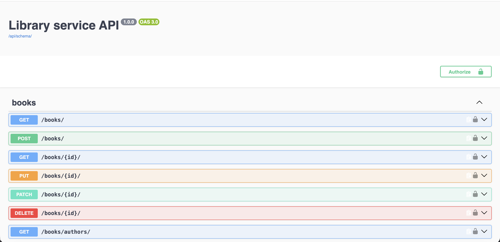
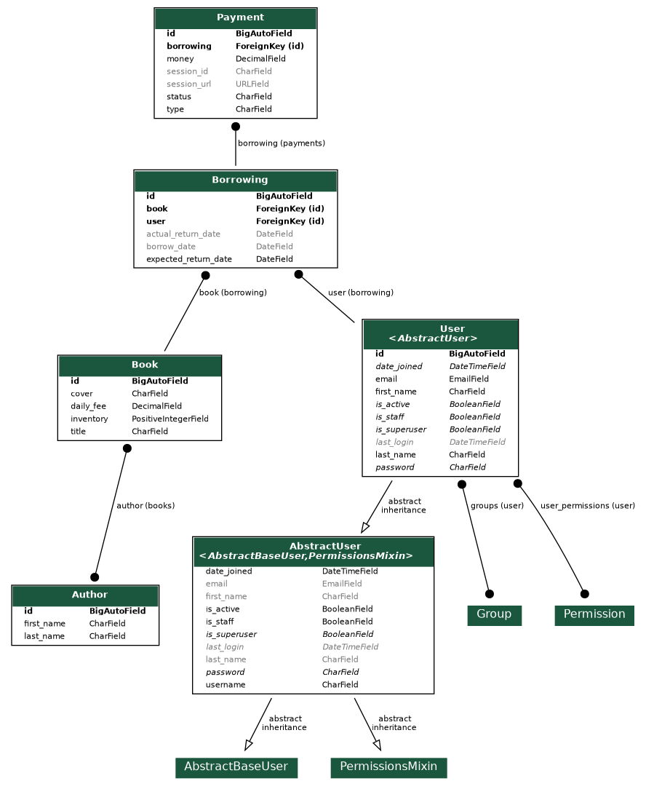

# api-library

An API service that solves the problem of online library automation, including online access to book rentals, payment options, and admin notifications via Telegram.

---

## Key features

* User Login via Email
* CRUD user and book service
* Filter by active and inactive leases
* Number of books available and the return process
* Imposition of a fine and its payment upon returning a book
* Scheduled review of overdue rent payments every day
* Stripe service for paying rent with a credit card
* Test coverage of 73%
* JWT token
* Telegram bot

---

## Tech Stack 

* **Backend & Frameworks:** Python 3.14, Django 5.0, Django REST Framework (DRF)
* **Authentication:** JWT
* **API Documentation:** OpenAPI, "drf-spectacular" (Swagger UI)
* **Task Queue & Async:** Celery, Celery Beat, Redis
* **Integrations:** Telegram Bot API
* **Database:** Postgres DB
* **DevOps & Containerization:** Docker, Docker Compose

---

## Docker installation and launch

1. git clone https://github.com/spmspi/api-library.git
2. docker-compose up --build
3. Open in your browser http://localhost:8000/

---

## Images

### Swagger

### Diagram 

